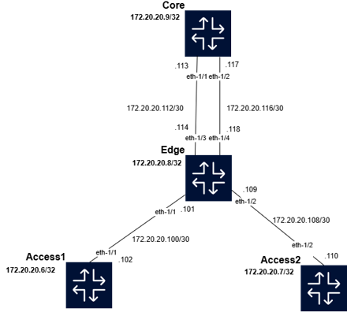

# 🔀 Network Automation: Static Routing with Ansible (Nokia SR Linux)

## 📖 Overview
This project demonstrates the **automation of static routing** in a small topology using **Ansible** and **Nokia SR Linux**.  
Instead of configuring routers manually via CLI, Ansible playbooks are used to push static route and next-hop configurations automatically across the network devices.

The topology is designed to show **Equal-Cost Multi-Path (ECMP)** routing, where traffic can take multiple paths with the same cost.

---

## 🛠️ Topology
The lab is built in a containerized environment (Containerlab). It contains:

- **2× Access Routers** (Access1, Access2)  
- **1× Edge Router** (Edge)  
- **1× Core Router** (Core)

## 🗺️ Topolog Diagram

  

